## 온라인 시험 AI 감독 서비스 - 프록토매틱 with Edint

## 📓 목차
1. [💻 개요](#💻-개요)
2. [💡 기획 배경](#💡-기획-배경)
3. [🗂️ 주요 기능](#🗂️-주요-기능) 
4. [📚 프로젝트 산출물](#📚-프로젝트-산출물)
5. [🏷️ 기술 스택 및 개발 환경](#🏷️-기술-스택-및-개발-환경)
6. [🦸 팀원 및 역할](#🦸-팀원-및-역할)

---

## 💻 개요
- 진행 기간 : 2024.10.14 ~ 2024.11.19
- 서비스명 : 프록토매틱(Proctormatic)
- 서비스 소개 : 자동 비식별화 및 이상행동을 감지하는 온라인 시험 AI 감독 서비스
  
 

## 💡 기획 배경
### 1. 문제점
온라인 시험 진행 시 신분증 저장 및 영상 녹화 등으로 인한 
- 딥페이크 등 사이버 범죄 가능성
- 개인정보 유출 문제 발생

### 2. 목적

- **자동 비식별화**
  : 시험 준비에 필요한 신분증과 얼굴 등록 시 클라이언트측에서 자동으로 비식별화  

- **본인인증 확인**
  : 신분증 확인, 신분증과 웹캠 얼굴의 유사도 판별, 이메일 인증의 세 가지 단게를 통한 본인 인증  

- **이상행동 감지**
  : Media Pipe를 통한 시선 분석과 YOLO v11을 통한 금지물품 감지로 이상행동 판단 

### 3. 기대효과
- 주최자 : 실시간 감시와 영상 검증 등 어렵고 피곤한 수작업을 AI에게 부과하여 부담 감소 및 편의성 증대
- 응시자 : 딥페이크 등 사이버 범죄 및 개인정보 유출 불안감을 해소하고 시험 응시에만 집중 가능

 

## 🗂️ 주요 기능

  
주요 기능 상세 설명

  #### **메인 페이지**
  <table>
    <tr>
      <th>메인페이지</th>
      <th>로그인</th>
    </tr>
    <tr>
      <td></td>
      <td>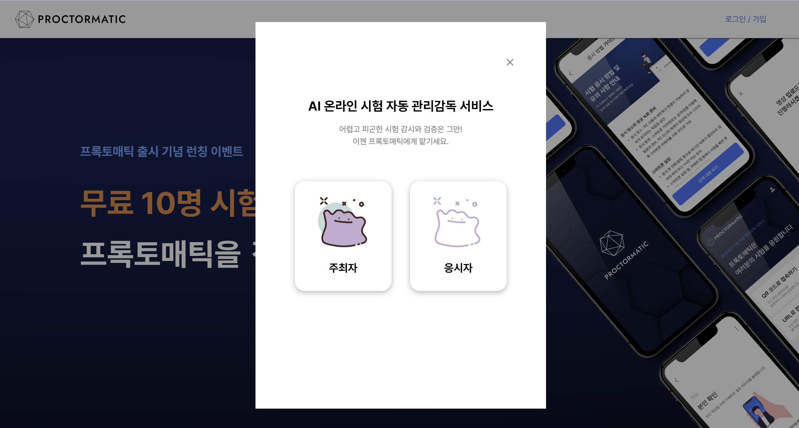</td> 
  </tr>
  </table>

  - `로그인`: 응시자/주최자를 선택하여 로그인

  #### **주최자 페이지(시험)**
  <table>
    <tr>
      <th>시험 등록</th>
      <th>시험 조회</th>
      <th>시험 수정 및 삭제</th>
    </tr>
    <tr>
      <td>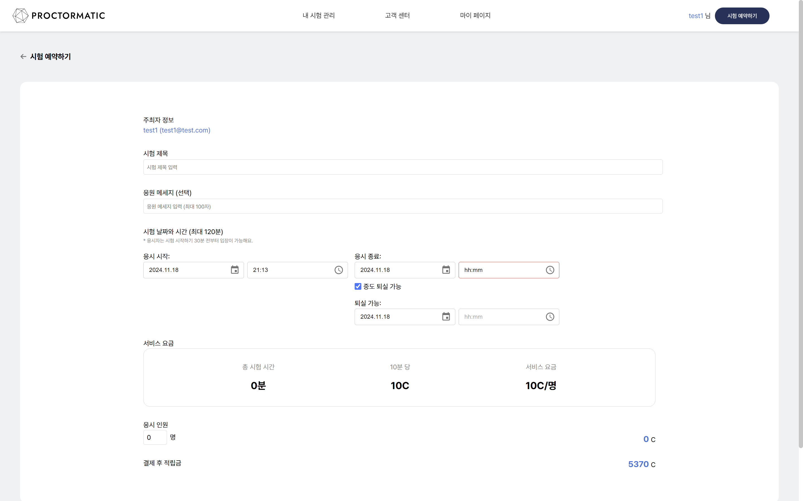</td>
      <td>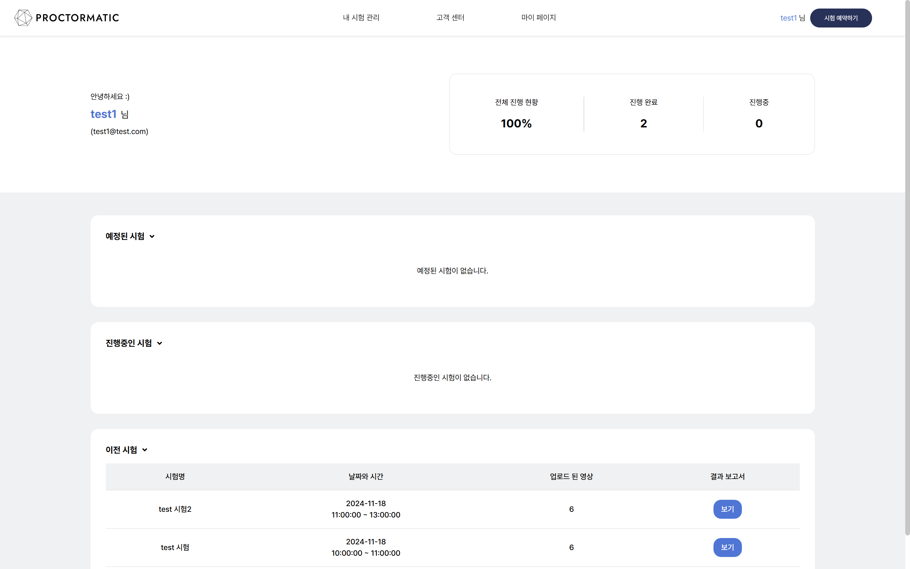</td>
      <td>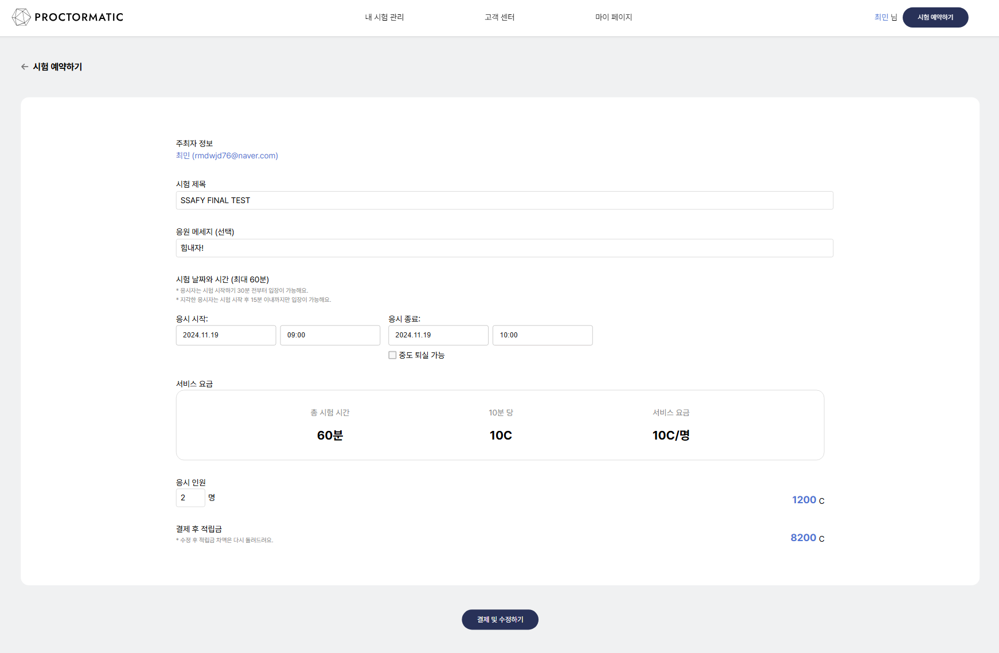</td>
    </tr>
  </table>

  - `시험 등록`: 시험 제목, 응원 메세지, 시험 날짜 및 시간, 응시 인원을 입력
  - `시험 조회`: 예정된 시험, 진행중인 시험, 이전 시험을 조회
  - `시험 수정 및 삭제` : 시험 관련 내용을 수정 및 삭제, 수정에서 인원수 변동에 따라 추가 요금 환불/결제가 일어남

  #### **주최자 페이지(보고서)**
  <table>
    <tr>
      <th>보고서</th>
      <th>세부 보고서</th>
    </tr>
    <tr>
      <td>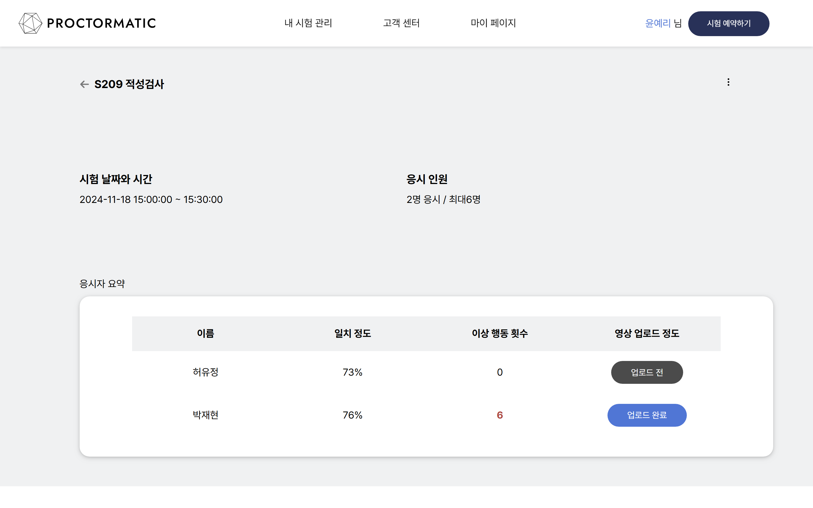</td>
      <td>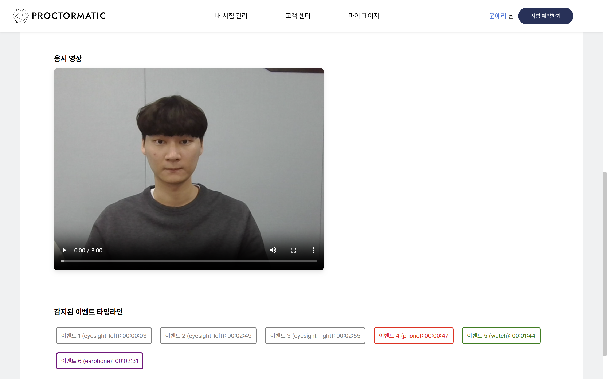</td>
    </tr>
  </table>

  - `보고서`: 시험 정보와 응시자들의 이름, 신분증 일치율, 이상행동 횟수, 영상 업로드 정도 등의 요약 정보 확인
  - `세부 보고서`: 응시자의 인적사항와 비식별화 된 신분증 사진 및 응시 영상과 감지된 이벤트 타임 라인 확인

  #### **주최자 페이지(적립금)**

  <table>
    <tr>
      <th>적립금 충전</th>
      <th>적립금 사용 내역 조회</th>
    </tr>
    <tr>
      <td>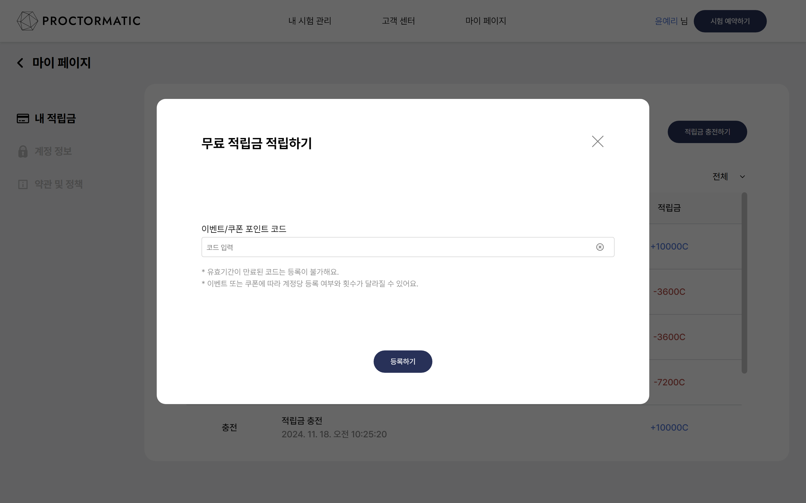</td>
      <td>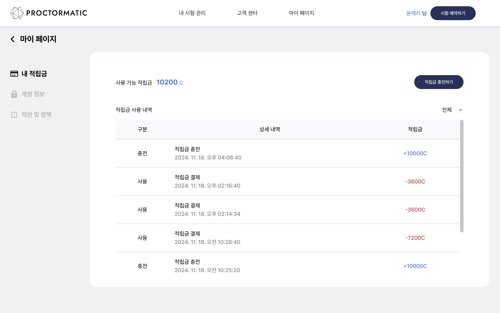</td>
    </tr>
  </table>

  - `적립금 충전`: 이벤트/쿠폰 코드를 통해 적립금을 충전
  - `적립금 사용 내역 조회`: 사용 및 충전한 적립금 조회

  #### **응시자 페이지**

  <table>
    <tr>
      <th>이메일 인증</th>
      <th>신분증 인증 & 비식별화</th>
      <th>영상 비식별화</th>
    </tr>
    <tr>
      <td>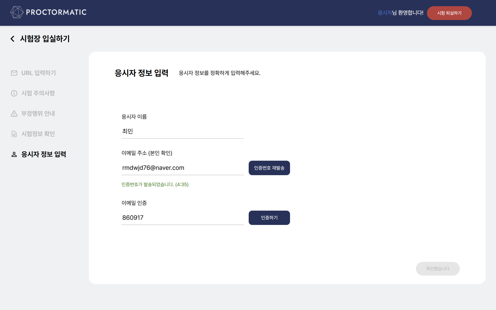</td>
      <td>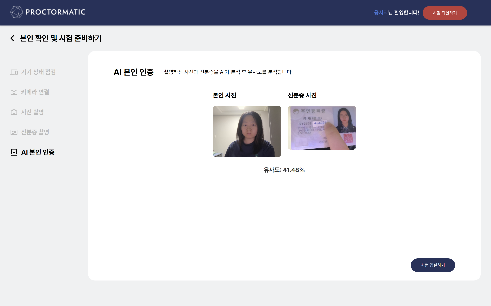</td>
      <td></td>
    </tr>
  </table>

  - `이메일 인증`: 이메일 인증을 통한 본인 인증
  - `신분증 인증 & 비식별화`: 신분증을 인식하여 증명사진과 웹캠을 통해 유사도 확인, OCR을 통한 이름 및 생년월일 파싱, 얼굴 비식별화 
  - `영상 비식별화`: 얼굴 비식별화

  #### **고객센터 페이지**
  <table>
    <tr>
      <th>자주 묻는 질문</th>
      <th>공지사항 & 질문</th>
    </tr>
    <tr>
      <td>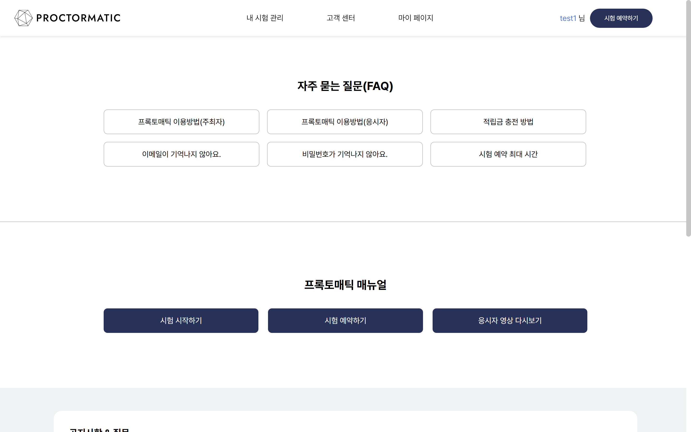</td>
      <td>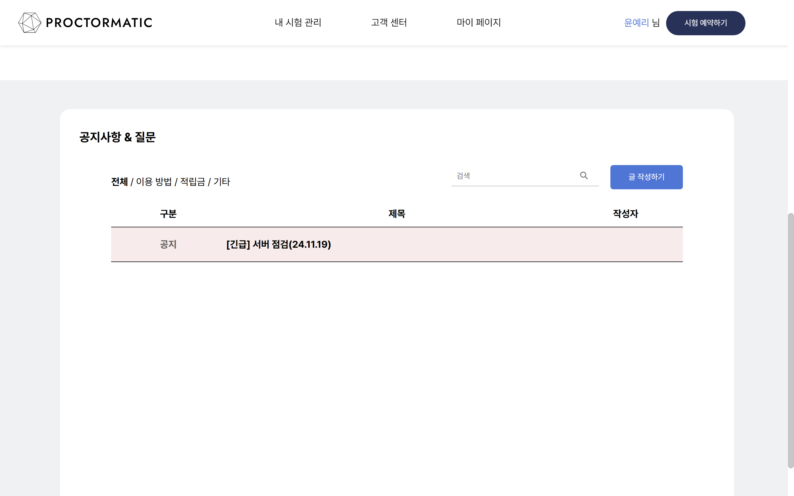</td>
    </tr>
  </table>

  - `자주 묻는 질문`: 사용자가 자주 묻는 질문 리스트
  - `공지사항 & 질문`: 서버 점검 등의 공지와 서비스 이용 시 문의사항 등록

---
 

### 1. 시험 예약 및 시험 관리
시험을 예약하고, 등록한 시험을 완료 상태에 따라 관리
### 2. 시험의 응시자 요약 보고서
시험에 접속한 응시자의 정보와 이상행동 여부 등을 보고서 형태로 제공
### 3. 시험 접속
URL을 통해 해당 시험에 접속하고, 시험 환경 구축까지 원스톱으로 해결

 

## 📚 프로젝트 산출물
### 1. 와이어프레임 및 목업([Figma](https://www.figma.com/design/721CTptBZ0aszWkbQHeMhU/S209?node-id=1-4240))

### 2. ERD([ERDCloud](https://www.erdcloud.com/d/9uEemxxkoDPjpvqEA))

### 3. 요구사항 명세서([Notion](https://cooing-lead-0e1.notion.site/122710d291b280e0b375d92ac892faf2))

### 4. API 명세서([Notion](https://cooing-lead-0e1.notion.site/API-114710d291b281aeaabde9db7283ef55?pvs=74))

### 5. 스토리보드([PoworPoint](https://docs.google.com/presentation/d/1mC0EN_QnnX9awXlHVOGpza4b8nKUcQx7/edit?usp=drive_link&ouid=115557606580033919178&rtpof=true&sd=true))

 

## 🏷️ 기술 스택 및 개발 환경
#### Language

#### Framework

#### DB

#### Dev

#### Message Broker

#### Environment

#### etc

 

## 🦸 팀원 및 역할
| **허유정** | **이승민** | **윤예리** | **박재현** | **이유찬** | **최민** |
|:--:|:--:|:--:|:--:|:--:|:--:|
|팀장  Back End|Back End Infra|Front End|Back End|Front End|Back End|